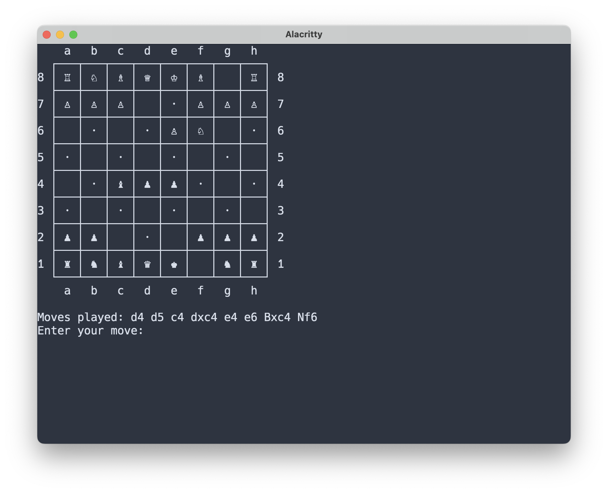

# `ChessGPT`
ChessGPT is a custom-trained transformer model that predicts and plays chess moves with remarkable accuracy. The model has no prior knowledge of the rules of chess - it merely learned the game after seeing several million grandmaster-level examples.

Key Features:
* Trained on the GPT-2 architecture using a massive dataset of high-quality chess games
* Predicts next moves with high accuracy based _only_ on the context of the previous moves
* Capable of playing full chess games against humans or other AI
* Provides details into move probabilities and decision-making process

## Setup

This project uses [Poetry](https://python-poetry.org/) for dependency management. The installation process differs depending on your use case:

### For Model Training and Playing

If you plan to train or use the model (requires GPU):

```sh
poetry install --with model
```

### For S3 Data Processing Only (e.g., EC2)

If you only need to run the S3 data processing scripts (e.g., on EC2):

```sh
poetry install --without model
```

This will install only the necessary dependencies for S3 operations without including model-related packages like PyTorch.

## Usage

### Quick start

The `explore` command will allow you to interact with the pre-trained models included in this project.

```sh
poetry run explore
```

This will open an interactive CLI that allows you to explore the models and play against them.


Then, you will be dropped into a chess game in the shell!



### Training pipeline

#### Reducing PGN database files

The model is trained against games that are represented as sequences of moves in algebraic notation, terminated by the outcome of the game (`1-0`, `0-1`, or `1/2-1/2`).

```
d4 e6 Nf3 g6 Bg5 Bg7 Bxd8 1-0
d4 Nf6 c4 g6 Nc3 Bg7 e4 d6 f3 e5 Nge2 1-0
e4 c5 Nf3 e6 d4 cxd4 Nxd4 1/2-1/2
...
```

Use the `reduce-pgn` script to transform a PGN database of chess games into the format described above. You can optionally segment the games by changing the `DIRECTORY_TO_ELO_RATING_RANGE` map in `scripts/reduce_pgn_to_moves.py`.

[Lichess](https://database.lichess.org) provides an open database of nearly 6B games in PGN format available for download, for free.

```console
$ poetry run reduce-pgn --help
usage: reduce-pgn [-h] --input-pgn-file INPUT_PGN_FILE --output-dir OUTPUT_DIR

Reduce a chess games PGN database file to a list of moves. The reduced files will be
organized by rating range (beginner, intermediate, master, grandmaster).

options:
  -h, --help            show this help message and exit
  --input-pgn-file INPUT_PGN_FILE
                        The input PGN file.
  --output-dir OUTPUT_DIR
                        The output directory, where one reduced file will be written per ELO
                        rating range. Any of these files can then be used in the `prepare-
                        training-data` step.
```

The default configuration for ELO ranges yields the following:

```console
$ poetry run reduce-pgn --input-pgn-file data/lichess_db_standard_rated_2024-06.pgn --output-dir out
Processing file...
Processed 1116435 games in beginner.
Processed 3120115 games in intermediate.
Processed 3285341 games in master.
Processed 111121 games in grandmaster.
Processed 0 games in unknown.
```

#### Generating training data

Once the games have been reduced to the format described above, you can use the `prepare-training-data` script to generate training and validation data sets.

```console
$ poetry run prepare-training-data --help
usage: prepare-training-data [-h] --input-reduced-pgn-file INPUT_REDUCED_PGN_FILE
                             [--output-training-data-file OUTPUT_TRAINING_DATA_FILE]
                             [--output-validation-data-file OUTPUT_VALIDATION_DATA_FILE]
                             [--max-context-length MAX_CONTEXT_LENGTH]
                             [--validation-split VALIDATION_SPLIT]

Prepares training and validation data sets for the model training step.

options:
  -h, --help            show this help message and exit
  --input-reduced-pgn-file INPUT_REDUCED_PGN_FILE
                        The input file, as returned by `poetry run reduce-pgn`.
  --output-training-data-file OUTPUT_TRAINING_DATA_FILE
                        Where to save the training data. Default: out/training-data.csv
  --output-validation-data-file OUTPUT_VALIDATION_DATA_FILE
                        Where to save the validation data. Default: out/validation-data.csv
  --max-context-length MAX_CONTEXT_LENGTH
                        The maximum number of moves to include in the context for the
                        examples written to the training and validation data files. Default:
                        10
  --validation-split VALIDATION_SPLIT
                        The proportion of the data to use for validation. Default: 0.1
```

#### Preparing the tokenizer

Next, use the `fit-and-save-tokenizer` script to fit the tokenizer to the training data. Pre-generating the tokenizer guarantees that the same tokenization is used both in training and inference.

```console
$ poetry run fit-and-save-tokenizer --help
usage: fit-and-save-tokenizer [-h] --input-training-data-file INPUT_TRAINING_DATA_FILE
                              [--output-tokenizer-file OUTPUT_TOKENIZER_FILE]

Fit and save the tokenizer.

options:
  -h, --help            show this help message and exit
  --input-training-data-file INPUT_TRAINING_DATA_FILE
                        The input training data file, as returned by `poetry run prepare-
                        training-data`
  --output-tokenizer-file OUTPUT_TOKENIZER_FILE
                        Where to save tokenizer state. Default: out/chess_tokenizer.json
```

#### Training

After preparing the training data and validation data sets using `prepare-training-data`, the `train-model` command will train the model with the given hyperparameters, and save the resulting model to a `.pth` file.


```console
$ poetry run train-model --help
usage: train-model [-h] --input-training-data-file INPUT_TRAINING_DATA_FILE
                   --input-validation-data-file INPUT_VALIDATION_DATA_FILE
                   [--input-tokenizer-file INPUT_TOKENIZER_FILE]
                   [--input-state-dict-file INPUT_STATE_DICT_FILE]
                   [--output-model-file OUTPUT_MODEL_FILE]
                   [--max-context-length MAX_CONTEXT_LENGTH] [--batch-size BATCH_SIZE]
                   [--num-embeddings NUM_EMBEDDINGS] [--num-layers NUM_LAYERS]
                   [--num-heads NUM_HEADS] [--num-epochs NUM_EPOCHS]
                   [--initial-learning-rate INITIAL_LEARNING_RATE]
                   [--show-random-baseline SHOW_RANDOM_BASELINE]

Train the LLM.

options:
  -h, --help            show this help message and exit
  --input-training-data-file INPUT_TRAINING_DATA_FILE
                        The input training data file, as returned by `poetry run prepare-
                        training-data`
  --input-validation-data-file INPUT_VALIDATION_DATA_FILE
                        The input validation data file, as returned by `poetry run prepare-
                        training-data`
  --input-tokenizer-file INPUT_TOKENIZER_FILE
                        The tokenizer file, as generated by `poetry run fit-and-save-tokenizer`.
                        Defaults to out/chess_tokenizer.json
  --input-state-dict-file INPUT_STATE_DICT_FILE
                        The state dict file to load the initial model from. If not provided,
                        the model will be randomly initialized.
  --output-model-file OUTPUT_MODEL_FILE
                        Where to save the `.pth` file for the trained model. Default:
                        out/chess_transformer_model.pth
  --max-context-length MAX_CONTEXT_LENGTH
                        The maximum context length (number of moves) to train against.
                        Default: 50
  --batch-size BATCH_SIZE
                        The batch size to use. Default: 128
  --num-embeddings NUM_EMBEDDINGS
                        The number of embeddings to use in the model. Default: 256
  --num-layers NUM_LAYERS
                        The number of layers to use in the model. Default: 4
  --num-heads NUM_HEADS
                        The number of heads to use in the model. Default: 4
  --num-epochs NUM_EPOCHS
                        The number of epochs to train the model for. Default: 10
  --initial-learning-rate INITIAL_LEARNING_RATE
                        The initial learning rate to use. Default: 0.001
  --show-random-baseline SHOW_RANDOM_BASELINE
                        Whether to show the random baseline loss. Default: True
```

Here's an example with a small model and dataset:

```console
$ poetry run train-model \
    --input-training-data-file out/training-data.csv \
    --input-validation-data-file out/validation-data.csv \
    --input-tokenizer-file out/chess_tokenizer.json \
    --max-context-length 5 \
    --num-embeddings 64 \
    --num-epochs 3 \
    --batch-size 32 \
    --num-layers 1 \
    --num-heads 1

###################################################################################################
## Training model with args:
Training data:          out/training-data.csv
Validation data:        out/validation-data.csv
Tokenizer file:         out/chess_tokenizer.json
State dict file:        None
Model output file:      out/chess_transformer_model.pth
Max length:             5
Batch size:             32
Num embeddings:         64
Num layers:             1
Num heads:              1
Num training epochs:    3
Initial learning rate:  0.001
###################################################################################################
Loading tokenizer...
Tokenizer initialized with vocab_size=305
Loading training/validation data...
Indexing CSV file: 100%|█████████████████████████████████| 6.32M/6.32M [00:00<00:00, 36.8MB/s]
Indexing CSV file: 100%|███████████████████████████████████| 704k/704k [00:00<00:00, 34.6MB/s]
Using device: mps
Calculating random baseline: 100%|█████████████████████| 14028/14028 [00:20<00:00, 677.71it/s]
Random baseline loss: 5.7613
Epoch 1/3, Train Loss: 1.9003, Val Loss: 1.7609, Learning Rate: 0.001000
Training Progress:  67%|██████▋   | 28056/42084 [05:35<02:49, 82.63it/s, epoch=2, loss=1.7381]
Epoch 2/3, Train Loss: 1.8021, Val Loss: 1.7376, Learning Rate: 0.001000
Training Progress: 100%|██████████| 42084/42084 [08:22<00:00, 87.52it/s, epoch=3, loss=1.9243]
Epoch 3/3, Train Loss: 1.7790, Val Loss: 1.7136, Learning Rate: 0.001000
Training Progress: 100%|██████████| 42084/42084 [08:27<00:00, 82.98it/s, epoch=3, loss=1.9243]
Model saved to: out/chess_transformer_model.pth
```

### Playing against the model

Once the model is trained via the pipeline described in the last section, you can play a chess game against it using the `play` script. You will need to use the same hyperparameters you used to train the model.

```console
$ poetry run play --help
usage: play [-h] --input-model-file INPUT_MODEL_FILE --input-tokenizer-file
            INPUT_TOKENIZER_FILE --max-context-length MAX_CONTEXT_LENGTH --num-embeddings
            NUM_EMBEDDINGS --num-layers NUM_LAYERS --num-heads NUM_HEADS
            [--color {white,black}] [--top-k TOP_K] [--debug]

Chess CLI for playing against a trained model

options:
  -h, --help            show this help message and exit
  --input-model-file INPUT_MODEL_FILE
                        Path to the trained model file
  --input-tokenizer-file INPUT_TOKENIZER_FILE
                        Path to the tokenizer file
  --max-context-length MAX_CONTEXT_LENGTH
                        The maximum context length (number of moves) that the model was
                        trained against.
  --num-embeddings NUM_EMBEDDINGS
                        The number of embeddings that the model was trained with.
  --num-layers NUM_LAYERS
                        The number of layers that the model was trained with.
  --num-heads NUM_HEADS
                        The number of heads that the model was trained with.
  --color {white,black}
                        Player's color
  --top-k TOP_K         Top-k sampling parameter
  --debug               Enable debug output
```

When it boots up, you will be dropped into a chess game in the terminal! You will need to enter moves in algebraic notation.

```console
    h   g   f   e   d   c   b   a
  ┌───┬───┬───┬───┬───┬───┬───┬───┐
1 │ ♜ │   │ · │ ♚ │ ♛ │   │ · │ ♜ │ 1
  ├───┼───┼───┼───┼───┼───┼───┼───┤
2 │ ♟ │ ♟ │ ♟ │ ♝ │   │ · │   │ ♟ │ 2
  ├───┼───┼───┼───┼───┼───┼───┼───┤
3 │ · │   │ ♞ │ ♟ │ · │ ♞ │ · │   │ 3
  ├───┼───┼───┼───┼───┼───┼───┼───┤
4 │   │ · │ ♝ │ · │ ♟ │ ♟ │   │ · │ 4
  ├───┼───┼───┼───┼───┼───┼───┼───┤
5 │ · │   │ · │   │ · │   │ · │   │ 5
  ├───┼───┼───┼───┼───┼───┼───┼───┤
6 │   │ ♙ │ ♘ │ · │   │ ♘ │   │ ♙ │ 6
  ├───┼───┼───┼───┼───┼───┼───┼───┤
7 │ ♙ │ ♗ │ ♙ │ ♙ │ ♙ │ ♙ │ · │   │ 7
  ├───┼───┼───┼───┼───┼───┼───┼───┤
8 │   │ ♔ │ ♖ │ · │ ♕ │ ♗ │   │ ♖ │ 8
  └───┴───┴───┴───┴───┴───┴───┴───┘
    h   g   f   e   d   c   b   a

Moves played: d4 Nc6 Nf3 g6 Bf4 Bg7 e3 Nf6 c4 O-O Be2 a6 Nc3 b5 b3 bxc4 bxc4
Enter your move:
```

## Appendix

### Quick way of validating that the model actually works

A quick way to validate that the model works is to use a small dataset of ~100,000 games with small hyperperameters, like the example shown above.

For convenience, here are the steps:

```sh
# Reduce the PGN
poetry run reduce-pgn --input-pgn data/lichess_db_standard_rated_2024-06.pgn --output-dir out

# Take a subset of the games
shuf -n 100000 out/master.txt > out/master-trunc.txt

# Prepare the training data
poetry run prepare-training-data --input-reduced-pgn-file out/master-trunc.txt --output-training-data-file out/training-data.csv --output-validation-data-file out/validation-data.csv --max-context-length 5

# Prepare the tokenizer
poetry run fit-and-save-tokenizer --input-training-data-file out/training-data.csv

# Train the model. Make sure to use the same max-context-length as above
poetry run train-model --input-training-data-file out/training-data.csv --input-validation-data-file out/validation-data.csv --input-tokenizer-file out/chess_tokenizer.json --max-context-length 5 --num-embeddings 64 --num-epochs 3 --batch-size 32 --num-layers 1 --num-heads 1
```

This takes about 5-10 minutes end-to-end on an M1 Macbook Pro, and produces a model that can play 5-10 "good" moves before it starts to lose the thread.

Then, either play the model using the `play` script to see what kinds of moves it makes, open the `run_trained_model.ipynb` notebook to explore the model and plug in any list of moves that you want. In either case, make sure the hyperparameters at the top match the ones used above.
